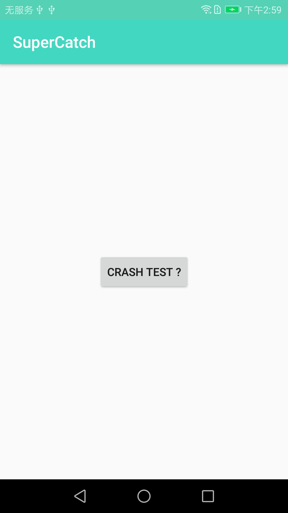
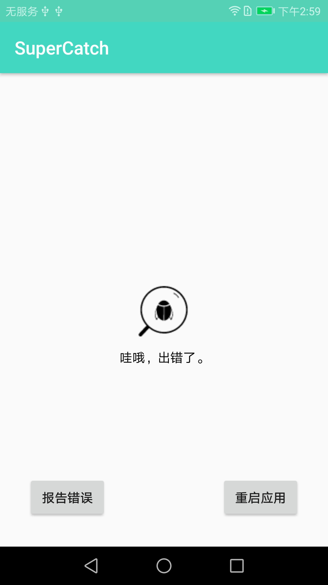
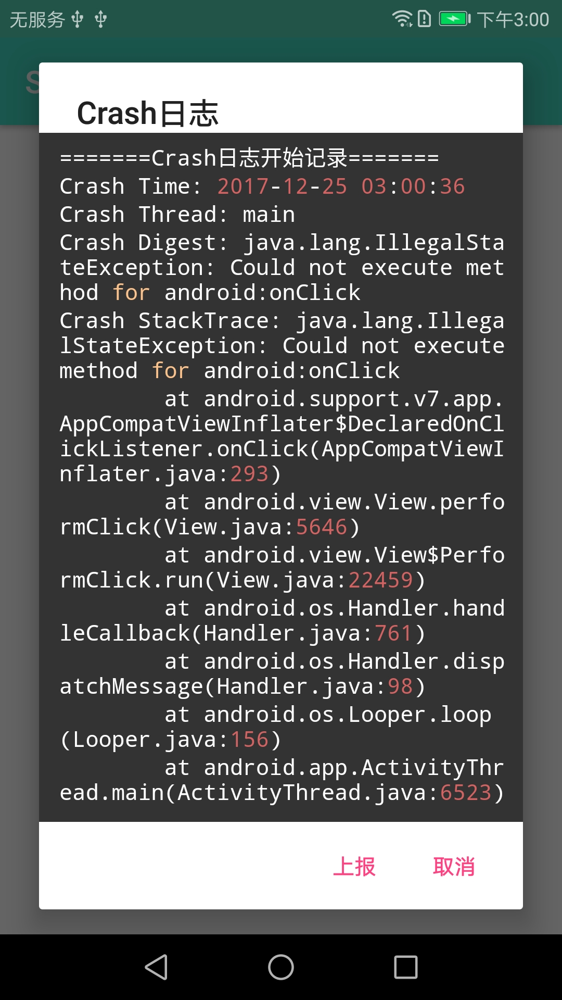
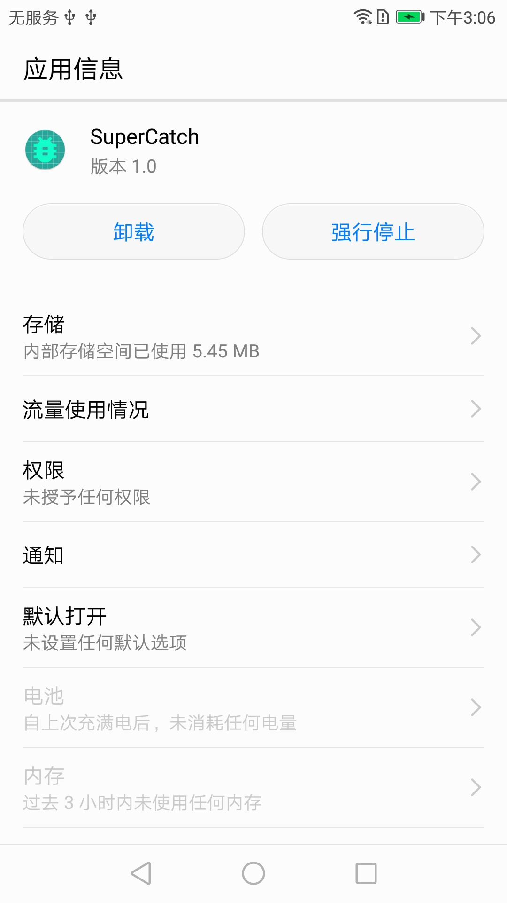

# SuperCatch

捕获应用Crash，重启应用或者上报Crash日志，让APP体验更人性化。

# 使用

> 依赖smilecatch，如下

```
compile 'me.chunsheng:smilecatch:0.0.1'
```

> 初始化，并且监听crash

```Java

//初始化，crashListener 可选，crashSave 可选。

CrashHandler.getInstance(this).crashListener(this).crashSave(true);

```

```Java

//监听Crash
implements CrashListener

@override
onCrashListener(){

//处理Crash逻辑
}


```

```Java

package me.chunsheng.supercatch;

import android.app.Application;
import android.content.Intent;

import me.chunsheng.smilecatch.CrashHandler;
import me.chunsheng.smilecatch.CrashListener;

/**
 * Copyright © 2017 edaixi. All Rights Reserved.
 * Author: wei_spring
 * Date: 2017/12/19
 * Email:weichsh@edaixi.com
 * Function: 自定义Application
 */
public class SuperCatchApplication extends Application implements CrashListener {

    public static final int DefaultRestart = 1;
    public static final int DefaultCrashPage = 2;
    public static final int CustomerCrashPage = 3;

    @Override
    public void onCreate() {
        super.onCreate();

        CrashHandler.getInstance(this).crashListener(this).crashSave(true);

    }

    /**
     * 监听crash，可以在这里处理crash，重启APP或者上报crash日志
     *
     * @param thread
     * @param throwable
     */
    @Override
    public void onCrashListener(Thread thread, Throwable throwable) {

        int catchType = 2;
        switch (catchType) {
            case DefaultRestart:
                try {
                    Intent intent = new Intent(this, Class.forName("me.chunsheng.supercatch.MainActivity"));
                    intent.putExtra("crash", true);
                    intent.addFlags(Intent.FLAG_ACTIVITY_CLEAR_TOP
                            | Intent.FLAG_ACTIVITY_CLEAR_TASK
                            | Intent.FLAG_ACTIVITY_NEW_TASK);
                    startActivity(intent);
                    android.os.Process.killProcess(android.os.Process.myPid());
                    System.exit(0);
                } catch (Exception e) {
                    e.printStackTrace();
                }
                break;
            case DefaultCrashPage:
                try {
                    Intent intent = new Intent(this, Class.forName("me.chunsheng.supercatch.CrashActivity"));
                    intent.putExtra("crash", true);
                    intent.addFlags(Intent.FLAG_ACTIVITY_CLEAR_TOP
                            | Intent.FLAG_ACTIVITY_CLEAR_TASK
                            | Intent.FLAG_ACTIVITY_NEW_TASK);
                    startActivity(intent);
                    android.os.Process.killProcess(android.os.Process.myPid());
                    System.exit(0);
                } catch (Exception e) {
                    e.printStackTrace();
                }
                break;
            case CustomerCrashPage:
                //自定义Crash提示页面
                break;

        }

    }
}


```


# Sample截图

点击Crash button，测试Crash



Crash页面



可以上报Crash，或者重启APP。
如果点击上报Crash，可以预览Crash日志，然后上报，如图



注意：如果是7.0+版本，日志的存储读取，需要获取读取权限，需要动态获取权限，
如果获取权限失败，需要提示用户手动去设置页面打开存储权限。



